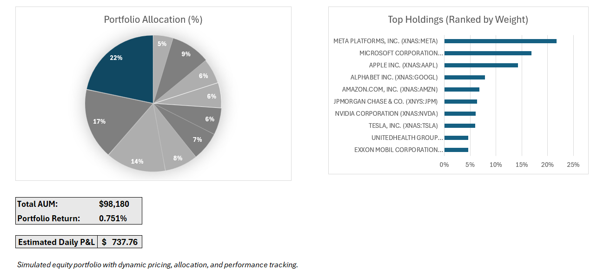
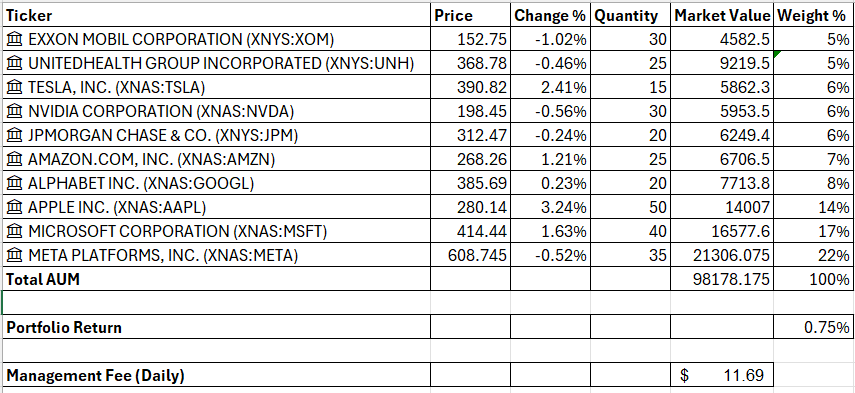
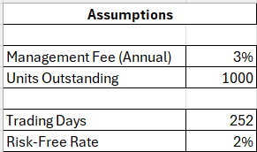

# Equity Portfolio Analysis Model

Dynamic Excel-based portfolio model for tracking portfolio performance, allocation, and daily P&L.

---

## Inputs
- Stock tickers (Excel Data Types)
- Prices (auto-updated)
- Quantity held
- Management Fee: 3%
- Trading Days: 252
- Risk-Free Rate: 2%

---

## Calculations
- Market Value = Price × Quantity  
- Total AUM = Sum of market values  
- Weight (%) = Position / Total AUM  
- Portfolio Return = SUMPRODUCT(Weights, Returns)  
- Daily P&L = AUM × Portfolio Return  
- Management Fee (Daily) = AUM × Fee / Trading Days  

---

## Dashboard Features
- Portfolio Allocation (Pie Chart)  
- Top Holdings by Weight (Bar Chart)  
- Key Metrics: AUM, Return, Daily P&L  

---

## Preview

### Dashboard Overview

### Data Model

### Assumptions

---

## Files Included
- Excel Model (.xlsx)
- PDF Version (Dashboard)
- Supporting Screenshots

---

## Author
Venessa Dsouza
